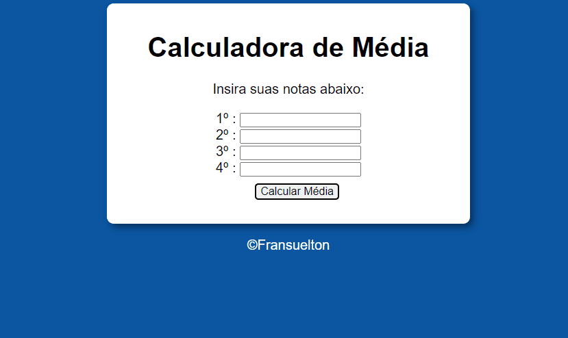

# Calculadora de Média 🚀

Projeto de calculadora de média simples, utilizei a média 6 para aprovação caso a média seja menor estará em recuperação.

[]

## Como utilizar :

1 - Clone o repositório

```
git clone url-do-repositório
```

2 - Insira as notas, é obtenha a média.

## Tecnologias Utilizadas

- HTML
- CSS
- JAVASCRIPT

### Obrigado por visitar meu repositório! ❤️